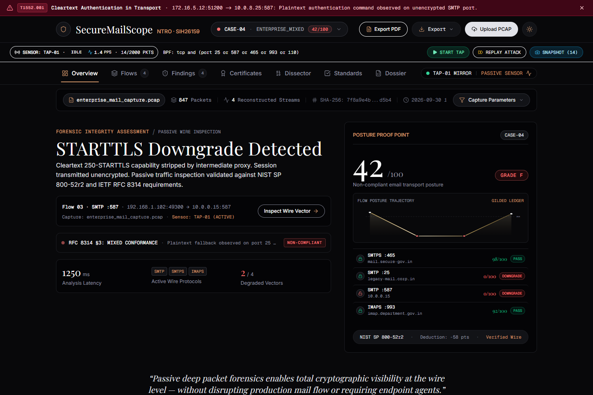
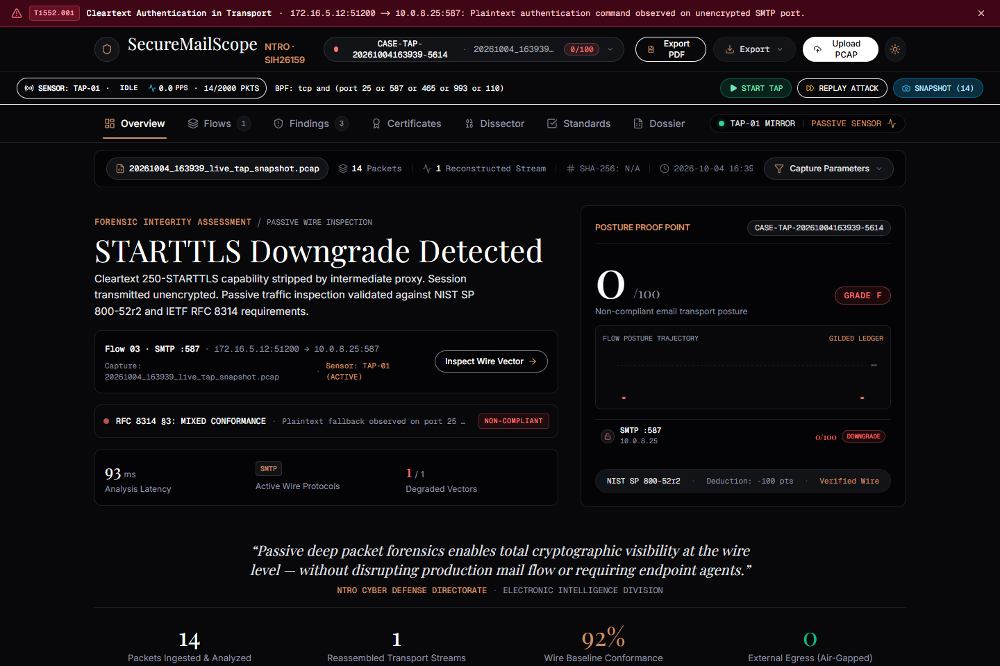
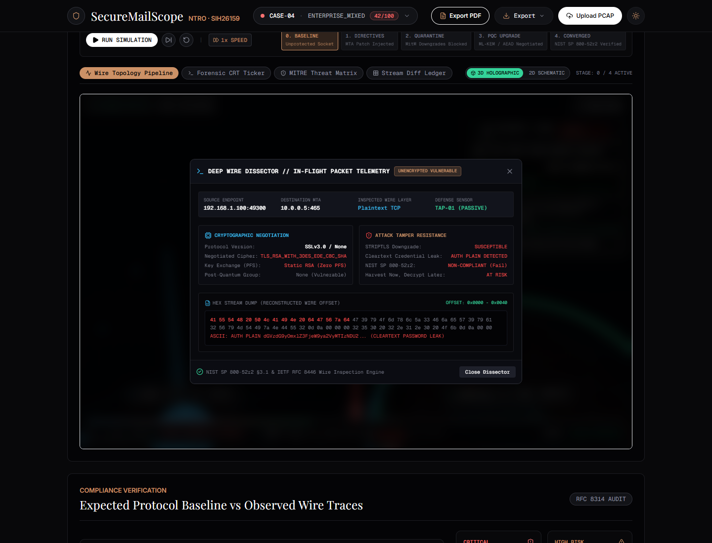
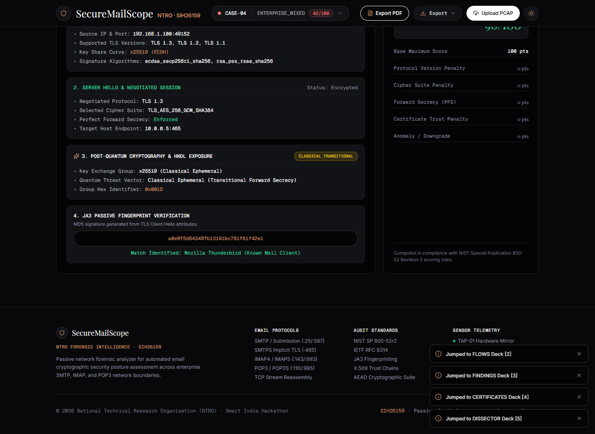
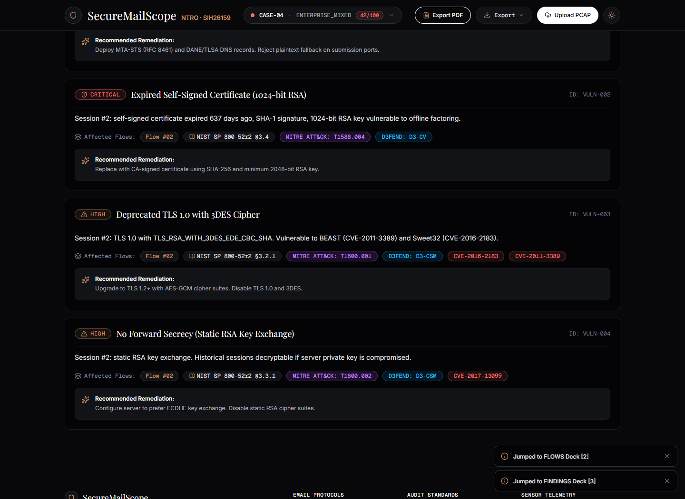
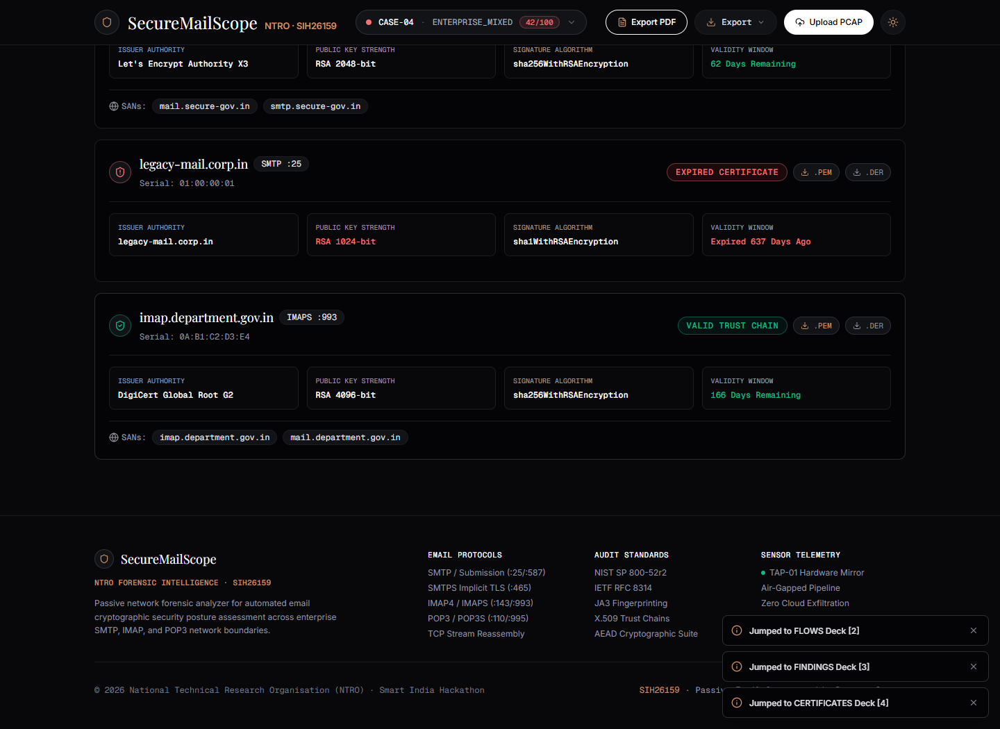
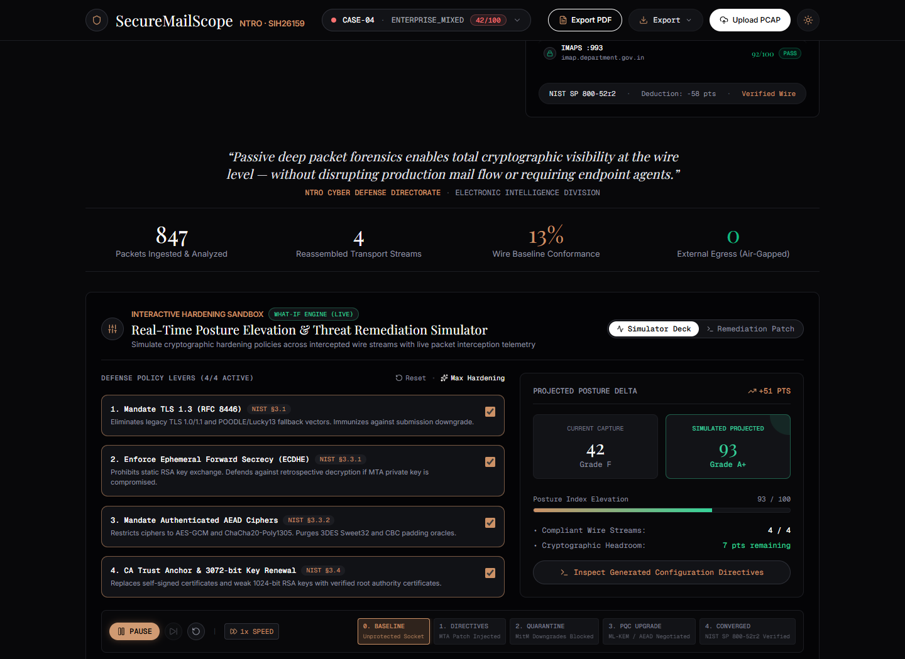
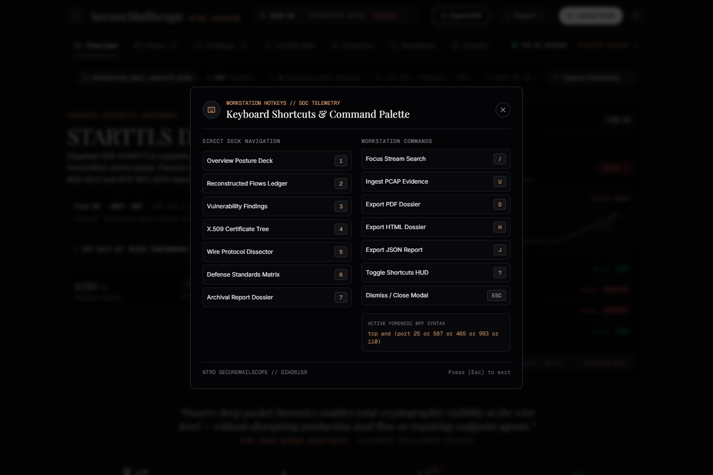

# SecureMailScope

**Passive Network Forensic Framework for Cryptographic Security Posture Assessment of Encrypted Email Communications.**  
Developed for **Smart India Hackathon (SIH 2026)** Problem Statement **SIH26159**, sponsored by the **National Technical Research Organisation (NTRO)**, Government of India.

---

## 1. Executive Summary

SecureMailScope is an enterprise-grade, passive network forensic platform designed to evaluate and audit the cryptographic security posture of email protocol communications (**SMTP**, **SMTPS**, **IMAP**, **IMAPS**, **POP3**, **POP3S**). Operating out-of-band on network tap data or captured PCAP files, SecureMailScope performs deep cryptographic analysis **without active traffic injection**, **without communicating with external certificate authorities**, and **without decrypting or inspecting email message contents**.

The platform detects protocol downgrade attacks (e.g. inline AiTM **STRIPTLS**), identifies deprecated protocols (**SSL 2.0/3.0**, **TLS 1.0/1.1**), audits ciphers and key exchanges (**PFS / ECDHE** vs static RSA), validates **X.509** certificate chains, fingerprints clients via **JA3**, classifies **Post-Quantum Cryptography (PQC)** readiness, and maps defensive countermeasures directly to **MITRE D3FEND** controls.

---

## 2. System Architecture

```
                                  NETWORK EVIDENCE
                                         │
                 ┌───────────────────────┴───────────────────────┐
                 │                                               │
          [PACKET CAPTURES]                               [LIVE WIRE TAP]
       (.pcap, .pcapng, .cap)                      (Physical / Virtual Adapters)
                 │                                               │
                 ▼                                               ▼
     ┌───────────────────────┐                      ┌─────────────────────────┐
     │  Spool Watcher Daemon │                      │   AsyncSniffer Sensor   │
     │   (spool/incoming/)   │                      │  (Threat Heuristics)    │
     └───────────┬───────────┘                      └────────────┬────────────┘
                 │                                               │
                 └───────────────────────┬───────────────────────┘
                                         ▼
                         ┌───────────────────────────────┐
                         │   PCAP & Stream Reassembly    │
                         │   (Ports 25, 465, 587, 993,   │
                         │    143, 110, 995)             │
                         └───────────────┬───────────────┘
                                         │
                 ┌───────────────────────┴───────────────────────┐
                 ▼                                               ▼
     ┌───────────────────────┐                      ┌─────────────────────────┐
     │  STARTTLS Detector    │                      │  TLS Handshake Parser   │
     │  (STRIPTLS Detection, │                      │  (ClientHello, Server-  │
     │   Cleartext Auth)     │                      │   Hello, Extensions)    │
     └───────────┬───────────┘                      └────────────┬────────────┘
                 │                                               │
                 └───────────────────────┬───────────────────────┘
                                         ▼
                         ┌───────────────────────────────┐
                         │  Cryptographic Posture Engine │
                         │  - X.509 DER Certificate Cert │
                         │  - JA3 MD5 Fingerprint Match  │
                         │  - PQC & HNDL Risk Evaluation │
                         │  - NIST SP 800-52r2 Scoring   │
                         └───────────────┬───────────────┘
                                         │
        ┌────────────────────────────────┼────────────────────────────────┐
        ▼                                ▼                                ▼
┌───────────────┐               ┌─────────────────┐             ┌──────────────────┐
│ Relational DB │               │ SIEM Forwarders │             │ Countermeasures  │
│ SQLite Async  │               │ - ArcSight CEF  │             │ - Ansible Plays  │
│ (SQLAlchemy)  │               │ - Syslog (:514) │             │ - Suricata Rules │
│ Read-Through  │               │ - SOAR Webhook  │             │ - Snort 3 Rules  │
│ Persistence   │               │ - WebSocket WS  │             │ - MITRE D3FEND   │
└───────┬───────┘               └────────┬────────┘             └────────┬─────────┘
        │                                │                               │
        └────────────────────────────────┼───────────────────────────────┘
                                         ▼
                         ┌───────────────────────────────┐
                         │   Next.js 14 SOC Workstation  │
                         │   (8 Decks, Posture Diff,     │
                         │    Dissector, Micro-Comps)    │
                         └───────────────────────────────┘
```

---

## 3. Core Enterprise Capabilities

### 3.1 Passive Cryptographic Dissection & Scoring
- **Full Stream Reassembly**: Reconstructs bi-directional TCP sessions handling TCP sequence wraparound and deduplication.
- **STARTTLS State Machine**: Identifies advertised vs negotiated transitions, flagging AiTM STRIPTLS downgrades and wire cleartext authentication exposure (`AUTH PLAIN` / `LOGIN`).
- **Binary Handshake Dissection**: Extracts offered/selected cipher suites, TLS version (SSL 2.0 to TLS 1.3), SNI, Supported Groups, and Point Formats.
- **X.509 Cryptanalysis**: Evaluates leaf certificate digests (SHA-1/MD5), public keys (RSA < 2048), validity windows, self-signed status, and SAN entries.
- **JA3 Fingerprinting**: Computes MD5 JA3 signatures with GREASE filtering and correlates against known mail client profiles.
- **Mathematical Scoring Formula**: Evaluates $100 - (V_{\text{proto}} + V_{\text{cipher}} + V_{\text{pfs}} + V_{\text{cert}} + V_{\text{anomaly}})$, mapping to enterprise grades (**A+** through **F**).

### 3.2 Live Wire TAP Sniffer & WebSocket Telemetry
- **Passive Sniffer Engine**: Scapy `AsyncSniffer` capturing frames on host/virtual adapters under BPF filter `tcp and (port 25 or 587 or 465 or 993 or 110)`.
- **In-Flight Threat Heuristics**: Immediate detection of STRIPTLS downgrades, cleartext authentication, and deprecated SSLv3 on the wire.
- **Packet Ring Buffer**: Thread-safe circular buffer (2,000 packets) supporting instantaneous snapshotting to forensic dossiers.
- **Simulated Attack Replay**: Out-of-band PCAP stream replay engine streaming attack captures at configurable rates (e.g., 12 PPS).
- **Live WebSocket Telemetry**: `ws://127.0.0.1:8000/api/ws/telemetry` streaming real-time packet rates, buffer counts, and security alerts.

### 3.3 Automated Spool Ingestion Daemon
- **Directory Monitoring**: Multi-folder watch architecture (`spool/incoming/` -> `spool/processed/` / `spool/quarantine/`).
- **File Lock Verification**: Handles active writes, partial transfers, and file size validation (50 MB cap).
- **On-Demand Sweeper**: Background worker with REST trigger (`POST /api/spool/scan`).

### 3.4 Relational Database Persistence (Async SQLAlchemy 2.0)
- **Relational Data Model**: Normalized SQLite tables (`CaptureCaseModel`, `FlowSessionModel`, `FindingModel`, `CertEvidenceModel`).
- **Read-Through Cache**: High-speed memory cache layered over asynchronous database queries.
- **Pre-Seeded Benchmarks**: Seeded reference cases (`CASE-01` to `CASE-04`) with Post-Quantum Cryptography (PQC) classification.
- **Case Management API**: Paginated listing, full dossier retrieval, and relational cascade deletion.

### 3.5 Enterprise SIEM & SOC Alerting
- **ArcSight CEF Serializer**: Common Event Format (`CEF:0|SecureMailScope|PassiveTAP|2.0|...`) with CRLF sanitization.
- **RFC 5424 Syslog Dispatcher**: UDP socket forwarder to port 514 UDP with facility and severity calculation.
- **SOAR Webhooks**: JSON payloads dispatched to Splunk HEC, Elastic, Slack, and Microsoft Teams.

### 3.6 Automated Remediation & MITRE D3FEND
- **Dynamic Ansible Playbooks**: Synthesizes idempotent Postfix and Dovecot hardening playbooks (`mail_hardening.yml`).
- **Suricata & Snort 3 Signatures**: Generates custom IDS signatures with SIDs 2615901–2615905.
- **MITRE D3FEND Matrix**: Direct mapping to defensive controls:
  - `D3-OTP`: Opportunistic Inbound TLS Verification (RFC 7817)
  - `D3-CSD`: Cipher Suite Deprecation Enforcement (NIST SP 800-52r2)
  - `D3-PFS`: Ephemeral Key Exchange Mandate (ECDHE)
  - `D3-CTA`: Certificate Trust & Signature Audit (X.509 RFC 5280)

### 3.7 Industrial Brutalist 3-Pane SOC Workstation
- **8 Operational Decks**: Overview, Flows, Findings, Certificates, Dissector, Standards, Remediation, Dossier.
- **Forensic Posture Diff Modal**: Side-by-side benchmarking against `CASE-01` NIST SP 800-52r2 baseline.
- **Micro-Component Confinement**: Every UI component strictly $< 150\text{ LOC}$.
- **Accessibility & Tactile Feedback**: WCAG 2.1 AA compliant, full keyboard operability (hotkeys `1`–`8`, `/`, `?`, `P`, `H`, `J`).

---

## 4. Visual Walkthrough & SOC Forensic Console

### 4.1 Executive Cryptographic Posture & Telemetry Deck

- **Posture Dial**: Circular gauge computing cryptographic security score (0–100) and letter grade (A+ to F) with tactile graduation marks.
- **Proof Band**: Metric counters aggregating stream volume, critical threat detections, unencrypted auth attempts, and legacy protocol shares.
- **3D Deflection Radar**: Visual representation of active protocol defenses, baseline conformity, and risk deflection vectors.

### 4.2 Passive Wire TAP Sniffer & In-Flight Threat Alarms

- **Out-of-Band Capture**: Scapy `AsyncSniffer` capturing frames on host and virtual adapters using BPF filter `tcp and (port 25 or 587 or 465 or 993 or 110)`.
- **Heuristic Threat Engine**: Real-time alerts emitted when detecting AiTM STRIPTLS downgrades, wire cleartext authentication (`AUTH PLAIN` / `LOGIN`), or SSLv3 rollbacks.
- **WebSocket Streaming**: Continuous telemetry feed pushed to connected SOC workstations via `ws://127.0.0.1:8000/api/ws/telemetry`.

### 4.3 Packet Ring Buffer Freeze & Case Dossier Generation

- **Volatile Ring Buffer**: Thread-safe circular buffer retaining the last 2,000 raw packets.
- **One-Click Dossier Freezing**: Instantaneous transition from live volatile packet streams to an immutable forensic case record persisted in SQLite.
- **Audit Export**: Automated generation of forensic reports in PDF, HTML, and JSON formats.

### 4.4 Dual-Mode Deep Protocol Dissector

- **Mode A (Cryptanalysis & Audit)**: Detailed breakdown of TLS record layer versions, selected ciphers, PFS key exchanges, X.509 certificate chains, JA3 client fingerprint hashes, and score penalty deductions.
- **Mode B (Raw Stream & Protocol State Machine)**: Monospaced ASCII and Hex wire stream inspection with exact byte offset annotations marking where `250-STARTTLS` was stripped or where the TLS record header (`0x16 0x03`) initiated.

### 4.5 Post-Quantum Cryptography (PQC) & HNDL Risk Assessment

- **Quantum-Resistant KEM Detection**: Recognizes Post-Quantum hybrid algorithms (e.g. `X25519Kyber768Draft00`) during TLS key exchange negotiation.
- **Harvest-Now-Decrypt-Later (HNDL) Analysis**: Identifies mail streams at risk of retrospective cryptanalysis and flags long-term data exposure.

### 4.6 Prioritized Security Findings & MITRE ATT&CK / D3FEND Mapping

- **Triage Matrix**: Categorized vulnerability ledger with CVSS severities (Critical, High, Medium, Low).
- **Adversary & Defense Alignment**: Direct cross-referencing between MITRE ATT&CK techniques (`T1557.002`, `T1552.001`, `T1600.001`) and MITRE D3FEND countermeasures (`D3-OTP`, `D3-CSD`, `D3-PFS`, `D3-CTA`).

### 4.7 X.509 Certificate Chain Inspection & PEM Export

- **Passive Cryptographic Parsing**: Extracts Subject/Issuer Distinguished Names, serial numbers, validity windows, and Subject Alternative Names (SANs).
- **Cryptographic Weakness Audit**: Flags weak signature digests (MD5/SHA-1), sub-2048-bit RSA keys, and self-signed certificates.
- **Forensic Extraction**: One-click raw PEM and DER certificate downloads for external verification.

### 4.8 Interactive What-If Hardening Simulator

- **Pre-Deployment Modeling**: Simulates configuration changes (disabling SSL/TLS 1.0, enforcing AEAD ciphers, mandating ECDHE key exchange) before touching production servers.
- **Instant Score Projection**: Recalculates cryptographic posture grade in real time to validate proposed security policies.

### 4.9 SOC Command Palette & Operator Shortcut HUD

- **Keyboard-Driven Workflow**: High-speed operator shortcuts (`1`–`8` deck jumping, `/` stream filtering, `?` HUD toggle, `P`/`H`/`J` report exporting).
- **Sub-Second Navigation**: Eliminates mouse dependency for SOC analysts conducting rapid incident triage.

---

## 5. Benchmark Reference Profiles

| Case Code | Dataset File | Score / Grade | Architecture Profile |
| :--- | :--- | :--- | :--- |
| **`CASE-01`** | `ntro_hardened_tls13.pcap` | **98 / 100 (A+)** | Modern SMTPS (:465) & IMAPS (:993) with TLS 1.3, AES-256-GCM, ECDHE X25519, valid X.509 certs. |
| **`CASE-02`** | `striptls_mitm_attack.pcap` | **12 / 100 (F)** | Active inline AiTM STRIPTLS downgrade on port 587, plaintext credential wire exposure. |
| **`CASE-03`** | `legacy_enterprise_3des.pcap` | **24 / 100 (F)** | Deprecated TLS 1.0, 3DES-EDE-CBC ciphers (Sweet32), static RSA (no PFS), expired SHA-1 cert. |
| **`CASE-04`** | `enterprise_mail_capture.pcap` | **42 / 100 (F)** | Mixed enterprise capture: compliant SMTPS alongside cleartext SMTP fallback and legacy ciphers. |

---

## 6. Quickstart & Deployment

### 6.1 Backend Setup (FastAPI & SQLite)
```bash
cd backend
python -m venv .venv
source .venv/bin/activate  # Or on Windows: .venv\Scripts\Activate.ps1
pip install -r requirements.txt

# Run server on port 8000
python -m uvicorn app.main:app --port 8000 --host 127.0.0.1
```
Swagger UI documentation is available at `http://127.0.0.1:8000/docs`.

### 6.2 Frontend Setup (Next.js 14)
```bash
cd frontend
npm install

# Run dev server on port 3000
npm run dev
```
Workstation dashboard is accessible at `http://localhost:3000`.

---

## 7. Verification & Quality Assurance

### Backend Unit & Integration Tests
```bash
pytest backend/tests -v
```
**Test Results**: `45 passed in ~26s` across database persistence, live TAP sniffing, threat heuristics, SIEM formatting, spool daemon sweeping, and remediation generation.

### Frontend Linting & Production Build
```bash
npm --prefix frontend run lint
npm --prefix frontend run build
```
**Build Results**: `0 errors, 0 warnings`. Static route pre-rendering successfully generated 5/5 routes. All components verified under 150 LOC.
