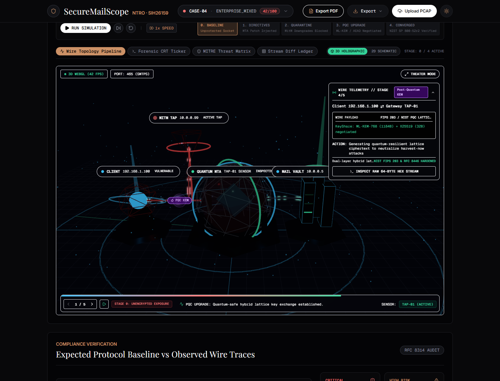

# SecureMailScope — Defense Workstation Interface

Modern 3-Pane SOC Operational Forensics Workstation for Passive Email Cryptographic Posture Assessment (Smart India Hackathon SIH 2026, Problem Statement SIH26159 for NTRO).

Built on Next.js 14 App Router, TypeScript, Tailwind CSS, Lucide React, and Recharts under strict `/usemax` micro-component constraints ($< 150\text{ LOC}$ per component) and WCAG 2.1 AA accessibility standards.

---

## 1. Workstation Decks & Navigation

The interface organizes forensic intelligence across 8 specialized operational decks, accessible via the navigation strip or SOC keyboard shortcuts:

1. **Overview Posture Deck (`[1]`)**:
   - Executive Cryptographic Posture dial with tactile tick marks, tabular numbers, and alarm indicators.
   - Proof statistics band and protocol divergence indicators.
   - Interactive What-If Hardening Sandbox for real-time posture elevation simulation.
   - Forensic Posture Diff Modal benchmarking active evidence against the `CASE-01` hardened baseline (NIST SP 800-52r2).

   

2. **Reconstructed Flows Ledger (`[2]`)**:
   - Tabular stream matrix showing reconstructed flow vectors (`src_ip:port -> dst_ip:port`).
   - Negotiated protocol badges (SMTP, SMTPS, IMAP, IMAPS, POP3, POP3S).
   - Cipher severity tags, Forward Secrecy flags, and PQC status indicators.

3. **Vulnerability Findings (`[3]`)**:
   - Prioritized security findings categorized by severity (Critical, High, Medium, Low).
   - Direct mappings to MITRE ATT&CK techniques (e.g. `T1557.002`, `T1552.001`, `T1600.001`) and CVE references.

4. **X.509 Certificate Tree (`[4]`)**:
   - Subject / Issuer Distinguished Name parsing.
   - Cryptographic validation: signature algorithms (SHA-1/MD5 detection), public key lengths (RSA < 2048), validity periods, and SAN entries.
   - Direct PEM and DER certificate downloads.

5. **Wire Protocol Dissector (`[5]`)**:
   - **Mode A (Cryptanalysis & Audit)**: JA3 MD5 client fingerprint identification, penalty deductions, and TLS extension breakdowns.
   - **Mode B (Raw Stream & Protocol State Machine)**: Monospaced ASCII and Hex stream dump with highlighted transition points (`0x16 0x03` TLS record header or stripped `250-STARTTLS`).

6. **Defense Standards Matrix (`[6]`)**:
   - Granular compliance pass/fail checklists for **NIST SP 800-52r2**, **RFC 8314**, and **BSI TR-02102-2**.

7. **Automated Remediation & MITRE D3FEND (`[7]`)**:
   - MITRE D3FEND matrix grid: 4 defensive controls (`D3-OTP`, `D3-CSD`, `D3-PFS`, `D3-CTA`) with prescribed hardening actions.
   - Playbook & IDS rule inspector: Live viewer with syntax formatting, copy to clipboard, and one-click download for Ansible (`mail_hardening.yml`), Suricata (`suricata_mail_rules.rules`), and Snort 3 (`snort3_mail_rules.lua`).

8. **Archival Dossier (`[8]`)**:
   - Complete formal audit report generation in **PDF** (ReportLab), **JSON**, and **HTML** formats.

---

## 2. Real-Time Telemetry & SOC Modals

- **Passive TAP Telemetry Bar**: Live packet counter, rate meter (PPS), and buffer capacity monitoring.
  - `[START/STOP TAP]`: Live wire sniffing on host/virtual interfaces.
  - `[REPLAY ATTACK]`: Streams synthetic AiTM STRIPTLS attack capture at configurable packet rates.
  - `[SNAPSHOT]`: Ingests in-memory packet ring buffer into an instantaneous forensic dossier.
- **Enterprise SIEM Telemetry Modal (`[SIEM :514]`)**:
  - RFC 5424 / CEF Syslog forwarder status (port 514 UDP).
  - HTTPS Webhook dispatcher statistics (SOAR, Slack, Teams).
  - Live alert audit trail with CEF payload inspection.
  - Simulated test alert dispatcher.
- **In-Flight Wire Threat Feed Drawer (`[THREATS: N]`)**:
  - Slide-out event feed displaying real-time anomalous SMTP/IMAP/POP3 patterns detected by wire heuristics.
- **Automated Spool Ingestion**:
  - Live directory watch indicator (`spool/incoming/`) embedded in the upload modal with on-demand sweep triggers.
- **Dynamic Case Selector**:
  - Merges SQLite persisted captures with built-in presets and provides in-UI deletion for custom sessions.

---

## 3. SOC Hotkey Cheat Sheet

| Key | Action |
| :--- | :--- |
| `1`–`8` | Jump directly to Workstation Deck (Overview, Flows, Findings, Certs, Dissector, Standards, Remediation, Dossier) |
| `/` | Focus stream search input |
| `?` | Open Keyboard Shortcuts & Command HUD |
| `P` | Export official forensic audit PDF |
| `H` | Export interactive HTML dossier |
| `J` | Download raw structured JSON analysis |
| `Esc` | Dismiss active modal or slide-out drawer |

---

## 4. Engineering Architecture & Guidelines

- **Micro-Components**: Every UI file strictly adheres to $< 150\text{ LOC}$ (hard ceiling 200 LOC).
- **Design Confinement**: Industrial brutalist defense console aesthetic using mathematical 1px structural grid lines, monospace typography, and zero generic marketing gradients.
- **Accessibility**: Semantic HTML landmarks (`<main>`, `<nav>`, `<aside>`, `<header>`), full keyboard navigation, and WCAG 2.1 AA compliant contrast ratios.

---

## 5. Getting Started

### Development
```bash
npm install
npm run dev
```
Open [http://localhost:3000](http://localhost:3000) in your browser.

### Linting & Production Build
```bash
npm run lint
npm run build
```
